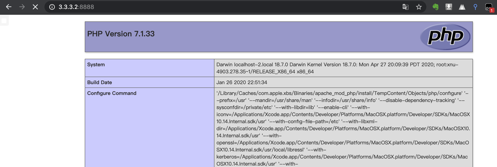
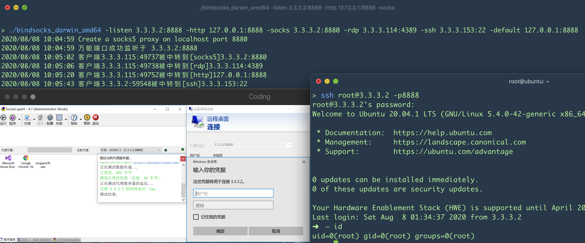

# Bindsocks

通常网络出口只有一个web的情况下, 除了上传 webshell 做 socks 代理, 我们还可以端口复用

- 必须满足的 -listen  和 -socks 监听端口使用, 其他参数任意
- -socks参数会创建一个本地监听的socks端口, 然后转发到8888端口上面, 所以无需再建socks
- 不支持连接建立之后服务器主动握手的协议，例如VNC，FTP，MYSQL…。
- SSH无法连接请更换连接工具
- **适用于 windows**, linux平台需要使用到 iptables做转发

```
bindsocks.exe -listen 3.3.3.2:8888 -http 127.0.0.1:8888 -socks 3.3.3.2:8880 -rdp 3.3.3.114:4389 -ssh 3.3.3.153:22 -default 127.0.0.1:8888

2020/08/08 10:04:59 Create a socks5 proxy on localhost port 8880
2020/08/08 10:04:59 万能端口成功监听于 3.3.3.2:8888
2020/08/08 10:05:02 客户端3.3.3.115:49737被中转到[socks5]3.3.3.2:8880
2020/08/08 10:05:06 客户端3.3.3.115:49738被中转到[rdp]3.3.3.114:4389
2020/08/08 10:05:20 客户端3.3.3.115:49752被中转到[http]127.0.0.1:8888
2020/08/08 10:05:43 客户端3.3.3.2:59548被中转到[ssh]3.3.3.153:22
```






图片仅演示, 溜了溜了🤪🤪🤪

## From

https://github.com/crabkun/switcher

